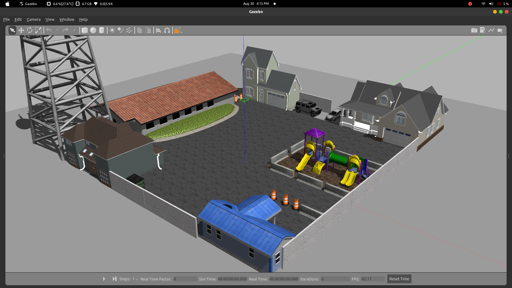

# Holonomic Drive Navigation

## Todos

- [ ] explore Nav stack using rviz2

This package contains the code for navigation tasks for the holonomic drive robot.

Install Dependencies to ensure all packages are installed.

    rosdep install --from-paths ./ -i -y --rosdistro humble --ignore-src
    pip install pynput

Launch the arena to test the code using the below-mentioned command.

    ros2 launch locomotion_control ddr_bot_world.launch.py # defaults cafe.world
    ros2 launch locomotion_control duke_bot_world.launch.py world:=smalltown.world

Run the keyboard controller to drive the duke bot. For ddr bot, `keyboard_control_ddr`

    ros2 run locomotion_control keyboard_control_hdr

    

    

